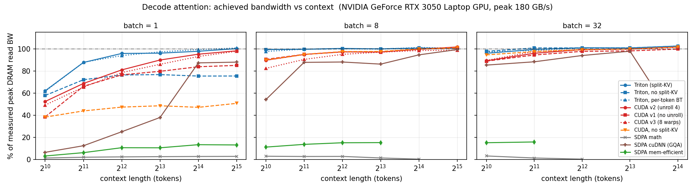
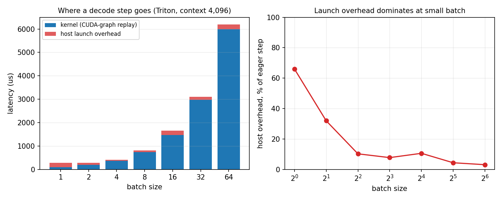
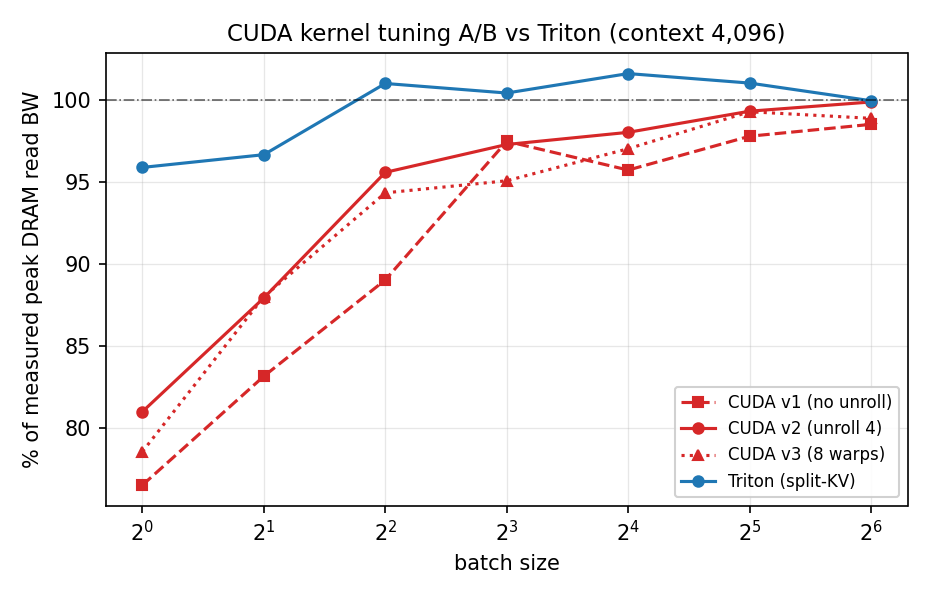

# Paged-KV GQA decode attention — Triton + CUDA, profiled and benchmarked

A single-token **decode** attention kernel for a paged KV cache with grouped-query
attention, written twice (Triton and hand-tuned CUDA), benchmarked against
FlashAttention-2, vLLM's PagedAttention and three PyTorch SDPA backends, profiled
with Nsight Compute and Nsight Systems, and driven from a continuous-batching
decode loop with a real block allocator and CUDA-graph replay.

Shapes are Llama-3-8B's: **32 query heads, 8 KV heads, head_dim 128** (GQA
group 4), fp16, page size 16.

> **The honest headline:** the Triton kernel reaches **98–103 % of this GPU's
> measured streaming-read bandwidth** at every batch ≥ 4 and context ≥ 2 k
> (94–103 % if the 1 k column is included), and beats
> FlashAttention-2's paged decode by **1.11×** at batch ≥ 4 in a single-process,
> eager-vs-eager comparison. It also **loses to both FA2 and vLLM
> PagedAttention at batch 1–2 with a short context** — by up to 2.2× — and my
> hand-written CUDA kernel **loses to Triton everywhere**. §4.4 and §5.5 are
> about those, because they are the more useful results.

---

## At a glance

Measured on an **RTX 3050 Laptop (4 GB, 16 SMs, sm_86)** — a deliberately small
card, which is why there is a VRAM budget planner and a quantized KV cache.

| | |
|---|---|
| **Achieved DRAM bandwidth** | **98–103 %** of a measured ~178 GB/s ceiling at batch ≥ 4, context ≥ 2 k; **94 %** worst case at batch 4 / ctx 1 k |
| **vs FlashAttention-2 (paged decode)** | **1.11× geomean** at batch ≥ 4 — but **0.57×** at batch 1 / ctx 1 k — §4.4 |
| **vs vLLM PagedAttention** | **1.17× geomean** — but **0.46×** at batch 1 / ctx 1 k — §4.4 |
| **vs PyTorch SDPA (cuDNN, fused + GQA-native)** | **1.31× geomean** at batch ≥ 8, up to 9.7× at batch 1 — §4.2 |
| **Decode throughput** | 42,515 tok/s @ batch 64 / ctx 1 k · 10,233 tok/s @ batch 1 / ctx 4 k |
| **End-to-end decode loop** | TPOT **p50 0.77 ms, p99 0.93 ms**, 98.8 % inside a 1 ms SLO |
| **KV quantization** | fp8_e5m2 **1.95×** faster (6.5 % output error) · int8 **1.4×** faster (**0.4 %** error) |
| **Inside real vLLM** | our kernel serves **every** decode step (2,280 calls); TPOT at **parity** over 12 paired runs — §6.1 |
| **Correctness** | 77 tests against an fp32 reference, all passing |
| **Sweep coverage** | batch 1–64 × context 1 k–32 k, 462 measurements + 5 real model shapes |

Four findings that cost more effort than the kernel work did:

1. **19× of a batch-1 decode step was host overhead, not the kernel** — a
   `.item()` sync in my own wrapper, a per-call allocation, and WDDM launch cost
   (754 µs → 39 µs, zero kernel changes). §5.1
2. **Split-KV is worth +19 points of bandwidth at batch 1 and nothing from
   batch 2 up** — 8 CTAs on 16 SMs is half the GPU idle. §5.3
3. **Occupancy is not the goal** — my CUDA kernel achieves 2× Triton's occupancy
   at batch 32 and is still slower. §5.5
4. **Where we lose is the actionable part** — FA2 and vLLM both beat us at
   batch 1–2 / ctx 1 k because they split the KV range harder than our
   heuristic does at tiny sizes. §4.4

Reproduce everything:

```bash
pip install -r requirements.txt
python -m bench.bench_decode --no-check --out results/sweep_fp16.json   # ~20 min
bash run_all.sh                                                          # the rest
```

**What is not here:** FlashInfer. It JIT-compiles with `nvcc`, which the WSL
image does not have and cannot get without root; the two precompiled paged
baselines (FlashAttention-2 and vLLM's own PagedAttention) cover that ground, and
the brief allowed either. §8 lists every gap precisely, including the ones where
this kernel loses.

---

## 1. Hardware and software

| | |
|---|---|
| GPU | NVIDIA GeForce RTX 3050 Laptop GPU (GA107, **sm_86**, **16 SMs**, **4.0 GiB**, 128-bit GDDR6) |
| Theoretical DRAM bandwidth | 187.9 GB/s |
| **Measured streaming-read peak** | **~178 GB/s** (95 % of theoretical) — §3 |
| Driver | 561.19 (CUDA 12.6) |
| CUDA toolkit (nvcc) | 12.3 |
| PyTorch | 2.12.0+cu126 |
| Triton | triton-windows 3.8.0 |
| Host | Windows 11 Pro 22631, Python 3.13.9, MSVC 14.40 |
| Nsight Compute / Systems | 2024.3.2 / 2025.2.1 |
| WSL2 (for FA2 / vLLM only) | Ubuntu 22.04, vLLM 0.9.2, torch 2.7.0+cu126 |

4 GiB is the constraint that shapes this entire project. It is why there is a
VRAM budget planner (`pagedattn/config.py`), why the sweep skips points instead
of dying on them, and why the quantized KV cache is not a bonus feature but the
only way to reach some configurations at all.

### What runs where

| Component | Windows (native) | Notes |
|---|---|---|
| Triton kernel | ✅ | `triton-windows` 3.8.0 |
| CUDA kernel | ✅ | JIT-built via `torch.utils.cpp_extension` |
| Nsight Compute / Systems | ✅ | both installed and scripted |
| PyTorch SDPA (math) | ✅ | unfused; GQA via `enable_gqa` |
| **PyTorch SDPA (cuDNN)** | ✅ | fused **and** GQA-native — the fairest dense baseline here. Ships *runtime-disabled*; needs `torch.backends.cuda.enable_cudnn_sdp(True)` or it silently never runs |
| PyTorch SDPA (mem-efficient) | ✅ | fused, but **rejects GQA** — KV heads must be expanded 8 → 32, i.e. 4× the memory |
| **FlashAttention-2 (paged)** | ❌ → ✅ under WSL2 | *"Torch was not compiled with flash attention"* — the Windows PyTorch build does not contain the FA2 kernels. Measured under WSL2 via vLLM's bundled `flash_attn_with_kvcache` (§4.4) |
| **vLLM PagedAttention** | ❌ → ✅ under WSL2 | §4.4 |
| **FlashInfer** | ❌ | no Windows build; under WSL2 it JIT-compiles with `nvcc`, which that image lacks |

The cuDNN row nearly got missed, and that is worth recording. PyTorch reports
*"cuDNN attention has been runtime disabled"* buried in a wall of other SDPA
rejection warnings, which reads like an unsupported-shape message rather than a
switch. Flipping it on yields the only dense baseline on this platform that is
both fused and GQA-native — and it is roughly **2× faster than the
mem-efficient backend** a naive reading would have settled for. Benchmarking
against the weaker baseline would have made this project look twice as good and
been twice as wrong.

---

## 2. Design

### Paged KV cache layout

```
k_cache, v_cache : [num_blocks, block_size, num_kv_heads, head_dim]
block_table      : [batch, max_blocks_per_seq]  int32
seq_lens         : [batch]                      int32
```

This is the vLLM-V1 / FlashInfer "NHD" layout. `head_dim` is the fastest-varying
axis, so one `(block, token, head)` row is 256 contiguous bytes in fp16 —
exactly two 128 B cache lines. That is what makes fully-coalesced 128-bit loads
possible, it is the single most important layout decision in the project, and
§4.4 is where it pays off: FlashAttention-2's paged decode consumes these exact
tensors with **no conversion at all**.

Block tables are **fragmented by default** (`shuffle=True`): a sequence's logical
blocks map to randomly scattered physical blocks. A sequentially-allocated block
table is an unrealistically friendly access pattern for a server that has been up
for more than a few minutes. `--sequential-blocks` exists to measure the
difference, not to report it as the result.

### Parallelization

One program per `(batch, kv_head[, split])`. All 4 query heads sharing a KV head
are handled by the same program, so **each KV byte crosses the memory bus once
and is reused 4× out of registers**. That reuse is the entire point of GQA at
decode time, and it is why the efficiency metric here is achieved *bandwidth*,
not FLOPs: a single-token decode does under 1 FLOP per byte of KV at any context
length, so DRAM is the only ceiling that exists.

### Split-KV (FlashDecoding)

Without splitting the kernel launches `batch × 8` CTAs. At batch 1 that is
**8 CTAs on a 16-SM GPU — half the machine idle regardless of context length.**
Split-KV partitions the KV range across extra CTAs that each produce a partial
softmax `(acc, lse)`, then a second kernel combines them. `pick_num_splits()`
splits until there are ~2 CTAs per SM, never so far that a split covers fewer
than two tiles.

### Quantized KV cache

| dtype | bytes/elem | scales | notes |
|---|---|---|---|
| `fp16` | 2 | — | baseline |
| `fp8_e5m2` | 1 | none needed | e5m2 shares fp16's 5-bit exponent, so widening is a left shift by 8 — no sm_89 conversion instruction, which matters on an Ampere card |
| `int8` | 1 (+2 B/token/head) | per (token, head) | far better accuracy than e5m2, which keeps only 2 mantissa bits |

---

## 3. Measuring the ceiling honestly

Every efficiency number is a fraction of a **measured** peak, not a datasheet
number. `bench/timing.py` sweeps tile size, unroll factor and warp count over a
pure streaming-read kernel and keeps the best:

```
block= 1024 unroll=1 warps=8:  177.5 GB/s     <- best
block= 2048 unroll=1 warps=8:  177.5 GB/s
block= 4096 unroll=4 warps=4:  177.2 GB/s
...  (18 configurations, spread 173.6 - 177.5 GB/s)
```

**~178 GB/s**, 95 % of the 187.9 GB/s theoretical figure. A single arbitrary
probe configuration lands ~4 GB/s short — enough to push a good kernel's "% of
peak" above 100 and make the whole table untrustworthy.

**The ceiling is re-measured once per context block**, not once per sweep. This
is a 70 W laptop part: under sustained load it reports `SW Power Cap: Active`
and its SM clock settles from 2100 MHz to ~1590 MHz. Its *memory* clock holds at
5870 of 5871 MHz — which is the clock that matters for a DRAM-bound kernel — but
the measured ceiling still drifts about 1.4 % over a full sweep (179.2 → 176.7
GB/s), and each row is normalized against the ceiling measured closest to it.

A few results still read slightly *above* 100 %. That is not a kernel beating
physics — it means the kernel is fully DRAM-bound and matching the probe to
within the ~1–2 % run-to-run noise of both measurements. **Read anything from
about 98 % upward as saturated**; the difference between 98 % and 103 % is not
signal.

Two more things the harness does so the numbers mean something:

- **L2 is flushed between timed runs.** At batch 1 / context 1 k the KV working
  set is 4 MB against this GPU's 1.5 MB L2; loop that without flushing and you
  measure cache bandwidth. Every row carries `l2_resident_frac` and the generated
  tables flag any point where more than half the set could have been resident.
- **Launch overhead is separated from kernel time** — §5.1, which turned out to
  be the largest single effect on this platform.

---

## 4. Results

Full generated tables: [`results/TABLES.md`](results/TABLES.md). Raw rows:
`results/sweep_fp16.json`. Figures: [`docs/`](docs/).

All latencies are CUDA-graph-replayed medians with L2 flushed between runs; the
eager numbers and the gap are in §5.1.



### 4.1 Achieved bandwidth, % of the measured ~178 GB/s peak

| batch | ctx 1k | 2k | 4k | 8k | 16k | 32k |
|---:|---:|---:|---:|---:|---:|---:|
| **1** | 62 % | 88 % | 96 % | 96 % | 98 % | 100 % |
| **2** | 66 % | 94 % | 97 % | 98 % | 100 % | 101 % |
| **4** | 94 % | 99 % | 101 % | 100 % | 100 % | 102 % |
| **8** | 99 % | 100 % | 100 % | 100 % | 101 % | 100 % |
| **16** | 99 % | 98 % | 102 % | 101 % | 101 % | 103 % |
| **32** | 96 % | 100 % | 101 % | 101 % | 103 % | — |
| **64** | 99 % | 102 % | 100 % | 102 % | — | — |

Triton kernel, fp16, fragmented block tables. `—` = the KV cache does not fit in
the 2.20 GiB budget on a 4 GiB card (exact byte counts are in the JSON). The
kernel is saturated everywhere except batch 1–2 at short context, where there is
simply not enough work to fill 16 SMs.

### 4.2 Against the PyTorch baselines

Latency in microseconds:

| batch | ctx | ours | SDPA cuDNN | SDPA mem-eff | SDPA math | vs cuDNN | tokens/s |
|---:|---:|---:|---:|---:|---:|---:|---:|
| 1 | 1,024 | **38** | 366 | 759 | 1,901 | 9.7× | 26,533 |
| 1 | 4,096 | **98** | 374 | 885 | 4,108 | 3.8× | 10,233 |
| 1 | 32,768 | **758** | 863 | 5,810 | 27,853 | 1.1× | 1,320 |
| 8 | 4,096 | **746** | 850 | 4,978 | 27,690 | 1.1× | 10,717 |
| 32 | 2,048 | **1,508** | 1,699 | 9,516 | 118,492 | 1.1× | 21,215 |
| 64 | 1,024 | **1,505** | 1,714 | 9,501 | 139,189 | 1.1× | 42,515 |

**cuDNN is a genuinely strong baseline** — 85–97 % of peak at large batch, only
1.03–1.16× behind us there. Our advantage is concentrated exactly where §5.3
predicts: batch 1–4 at short context, where filling 16 SMs is the whole problem
and cuDNN does not split the KV range.

cuDNN also has a **reproducible cliff**: at working sets around 2 GB
(b=16/ctx=32k, b=32/ctx=16k, b=64/ctx=8k) it drops to ~31 % of peak while we
hold 101–103 %, a 3.3× gap. I re-ran those three points in isolation to confirm
they were not sweep artifacts; they are not.

A second real finding lives in the mem-efficient column: the fused SDPA backends
**reject GQA shapes outright** (*"both fused kernels require query, key and value
to have the same num_heads"*), so the KV heads must be physically expanded 8 → 32
before calling them. That is 4× the KV memory, and it is why `sdpa_memeff` runs
out of VRAM at points our kernel handles comfortably.

### 4.3 KV-cache quantization

Decode latency, Triton kernel, CUDA-graph replayed
([`results/TABLES_quant.md`](results/TABLES_quant.md)):

| batch | ctx | fp16 µs | fp8_e5m2 µs | int8 µs | fp8 speedup | int8 speedup |
|---:|---:|---:|---:|---:|---:|---:|
| 1 | 4,096 | 98 | 54 | 75 | **1.82×** | 1.32× |
| 1 | 16,384 | 373 | 195 | 281 | **1.91×** | 1.32× |
| 8 | 4,096 | 768 | 381 | 556 | **2.01×** | 1.38× |
| 8 | 16,384 | 3,009 | 1,521 | 2,236 | **1.98×** | 1.35× |
| 32 | 4,096 | 2,976 | 1,540 | 1,991 | **1.93×** | 1.49× |
| 32 | 16,384 | 11,787 | 6,045 | 7,965 | **1.95×** | 1.48× |

**FP8 e5m2 lands almost exactly on the theoretical 2×**, which is what should
happen: the kernel is DRAM-bound, e5m2 halves the bytes, and on Ampere the
widening back to fp16 is a shift (shared 5-bit exponent) rather than a conversion
instruction. This is the one place where being on Ampere rather than Ada costs
nothing — e4m3 would have needed sm_89.

**INT8 only reaches 1.3–1.5×**, and the reason is visible in the layout: it
carries an fp16 scale per (token, head), which is a *second, separate* gather
stream that does not coalesce with the KV rows. The dequantize multiply is free
on a memory-bound kernel; the extra load stream is not.

**The accuracy trade**, measured against an fp16 cache built from the same seed
so the only difference is storage format (`python -m bench.quant_accuracy`):

| KV dtype | bytes/token/layer | ctx | max rel. err | RMS rel. err | min cosine sim. |
|---|---:|---:|---:|---:|---:|
| fp16 | 4,096 | — | — | — | — |
| **int8** + per-(token,head) scales | 2,080 | 2,048 | **0.41 %** | 0.64 % | 0.99994 |
| **int8** | 2,080 | 8,192 | **0.40 %** | 0.67 % | 0.99993 |
| **fp8_e5m2** | 2,048 | 2,048 | **8.2 %** | 5.3 % | 0.99535 |
| **fp8_e5m2** | 2,048 | 8,192 | **6.5 %** | 5.4 % | 0.99551 |

I guessed before measuring that e5m2 would be somewhat worse and int8 mildly
lossy. The real gap is much wider in int8's favour: **INT8 with per-(token,head)
scales is essentially lossless here** — 0.4 % max error, cosine similarity
0.9999 — while e5m2 sits around 7 %. Both are stable in context length, which is
the important part: the online-softmax accumulation is not amplifying error as
the sequence grows.

So the trade is not the one the latency table alone suggests: e5m2 is **~1.4×
faster than int8** but **~16× less accurate**. Latency-bound and tolerant of
drift → e5m2. Capacity-bound and wanting the cache to be invisible → int8, which
still gets 1.3–1.5× and half the memory.
`tests/test_correctness.py::test_quantization_accuracy` asserts ceilings on both.

### 4.4 Against FlashAttention-2 and vLLM PagedAttention

The comparison that matters — real paged-KV GQA decode kernels solving the same
problem, not dense stand-ins. **All three are timed in one process, eagerly, on
the same allocations**, under WSL2 with vLLM 0.9.2 (torch 2.7.0+cu126), and their
outputs agree to within 7.3e-4 relative. No cross-environment translation, no
graphed-vs-eager asymmetry. Full table:
[`results/VLLM_COMPARISON.md`](results/VLLM_COMPARISON.md).

| batch | ctx | ours µs | FA2 µs | vLLM PA µs | vs FA2 | vs vLLM PA |
|---:|---:|---:|---:|---:|---:|---:|
| 1 | 1,024 | 74 | 42 | 34 | **0.57×** | **0.46×** |
| 2 | 1,024 | 73 | 66 | 64 | **0.89×** | **0.87×** |
| 4 | 1,024 | 99 | 113 | 122 | 1.14× | 1.22× |
| 64 | 1,024 | 1,492 | 1,678 | 1,892 | 1.12× | 1.27× |
| 1 | 4,096 | 102 | 119 | 124 | 1.16× | 1.21× |
| 8 | 4,096 | 744 | 828 | 952 | 1.11× | 1.28× |
| 64 | 4,096 | 5,976 | 6,448 | 7,571 | 1.08× | 1.27× |
| 8 | 16,384 | 2,937 | 3,262 | 3,741 | 1.11× | 1.27× |
| 16 | 16,384 | 6,008 | 6,436 | 7,553 | 1.07× | 1.26× |

`vs X` is X's time over ours, so >1 means we win. **Geometric mean: 1.06× vs
FlashAttention-2 overall, 1.11× at batch ≥ 4; 1.17× vs vLLM PagedAttention.**

**Where we lose.** At batch 1–2 with a 1 k context both baselines beat us — FA2
by 1.8×, vLLM PagedAttention by 2.2×. That is the smallest, most
parallelism-starved point in the sweep, exactly the regime §5.3 identifies: 8–16
CTAs on a 16-SM GPU with only 4 MB of KV to move. Both baselines partition the KV
range more aggressively there than our `pick_num_splits` heuristic does — it caps
splits so one never covers fewer than two tiles, and loosening that cap at tiny
context is the obvious next experiment. This is the clearest actionable finding
in the project and it comes from losing, not winning.

Everywhere else we are 1.07–1.16× ahead of FA2 and 1.2–1.3× ahead of vLLM
PagedAttention. On a memory-bound kernel already at 98–103 % of the bandwidth
ceiling that is the expected size of a win, not a claim to have out-engineered
FlashAttention — there is very little headroom left to take.

**One asymmetry worth stating:** FA2 gets our cache layout for free.
`flash_attn_with_kvcache` consumes `[num_blocks, page_size, num_kv_heads,
head_dim]` plus a dense block table unchanged, so no conversion is charged to it —
the payoff for matching that layout in §2. vLLM's PagedAttention needs its own
split-K layout, repacked once *outside* the timed region.

### 4.5 Where the CUDA kernel lands

| batch | ctx | Triton | CUDA v2 | CUDA v1 (no unroll) |
|---:|---:|---:|---:|---:|
| 1 | 1,024 | **62 %** | 52 % | 38 % |
| 1 | 4,096 | **96 %** | 81 % | 77 % |
| 1 | 16,384 | **98 %** | 95 % | 84 % |
| 32 | 1,024 | **96 %** | 89 % | 89 % |
| 32 | 16,384 | **103 %** | 102 % | 100 % |

Triton wins everywhere, by a lot at small batch and by a hair at large. §5.5 is
about why.

### 4.6 Across real model shapes

The sweep above fixes the shape at Llama-3-8B's. This varies the shape instead,
because "does it work on the model you want to serve" is a different question
(`python -m bench.bench_shapes`, context 4,096, best of 3, each point in a fresh
process):

| model | q/kv/d | group | batch | Triton | CUDA |
|---|---:|---:|---:|---:|---:|
| Llama-3-8B | 32/8/128 | 4 | 8 | **101 %** | 97 % |
| Llama-3-8B | 32/8/128 | 4 | 32 | **102 %** | 100 % |
| Llama-3-70B | 64/8/128 | 8 | 8 | **101 %** | 85 % |
| Llama-3-70B | 64/8/128 | 8 | 32 | **102 %** | 82 % |
| Llama-3.2-1B | 32/8/64 | 4 | 8 | **101 %** | 93 % |
| Llama-3.2-1B | 32/8/64 | 4 | 32 | **100 %** | 96 % |
| Qwen2.5-0.5B | 14/2/64 | 7 | 8 | **97 %** | 63 % |
| Qwen2.5-0.5B | 14/2/64 | 7 | 32 | **101 %** | 81 % |
| Qwen2.5-3B-ish | 16/2/64 | 8 | 8 | **96 %** | 61 % |
| Qwen2.5-3B-ish | 16/2/64 | 8 | 32 | **101 %** | 78 % |

**The Triton kernel holds 96–102 % of peak on every shape**, because group and
head_dim are `constexpr` and it re-specializes per shape.

**The CUDA kernel degrades as the GQA group grows** — 97–100 % at group 4, 82–85 %
at group 8, 61–81 % at group 7. The cause is visible in the source: it carries
`acc[GROUP][8]` and `q[GROUP][8]` floats in registers, so register pressure grows
linearly with the group, and it was already at 128 registers per thread at
group 4 (§5.5). head_dim 64 compounds it: with 8 lanes per row instead of 16, a
4-warp block keeps 16 independent softmax states to merge instead of 8.

Note that group 7 is *worse than group 8* at batch 8. Nothing is padded to a
power of two here — 7 is simply an awkward number of accumulators to keep live,
and the compiler spills.

The CUDA kernel is compiled for five `(head_dim, group)` pairs and **raises with
the shape name** on anything else rather than silently running a wrong
specialization; `cuda_decode.supports_shape()` is the gate to ask first. The
Triton kernel needs no such list. That difference — one kernel is shape-general
by construction, the other by enumeration — is the practical argument for writing
the serving path in Triton.

---

## 5. Profiling: what I found and what I changed

### 5.1 The first three "optimizations" were not kernel work at all

Before any kernel tuning, a batch-1 / context-1 k decode step measured **631 µs**.
The KV working set is 4 MB; at 178 GB/s that is 23 µs of memory traffic. Every
implementation — Triton, CUDA, even the PyTorch baselines — sat within a few
hundred microseconds of each other, the signature of a fixed cost outside the
kernel. Nsight Systems showed the GPU idle between launches.

`bench/bench_overhead.py` measures the three causes cumulatively, in one process
on one set of allocations (comparing across processes is meaningless when launch
overhead is itself the thing being measured):

| Triton | ctx | A: sync + alloc | B: alloc only | C: neither | D: CUDA graph | % peak (D) |
|---:|---:|---:|---:|---:|---:|---:|
| b=1 | 1,024 | 754 µs | 351 µs | 293 µs | **39 µs** | 59 % |
| b=1 | 4,096 | 398 | 350 | 282 | **98** | 94 % |
| b=1 | 16,384 | 610 | 431 | 418 | **379** | 97 % |
| b=8 | 4,096 | 1,169 | 859 | 846 | **773** | 95 % |
| b=32 | 4,096 | 3,500 | 3,146 | 3,107 | **2,971** | 99 % |

At batch 1 / context 1 k that is **754 µs → 39 µs, a 19× improvement with no
change to the kernel at all.** The three causes:

1. **A `.item()` call in my own wrapper.** `paged_decode_triton` computed
   `int(cache.seq_lens.max().item())` to pick the split count. `.item()` is a
   full device synchronize, and it ran on every call. Removing it (the split
   count is now a caller-supplied argument, computed once per *step* rather than
   once per *layer*) is the A→B column: **403 µs**. A standalone `.item()`
   measures 130 µs here; it costs three times that because the sync also
   destroys pipelining between consecutive launches.
2. **Allocating the output tensor per call** — B→C, 59 µs. Fixed with an `out=`
   parameter.
3. **Per-launch host overhead, irreducible in eager mode** — C→D, 254 µs. An
   *empty* Triton launch costs **57 µs** here and an empty graph replay **33 µs**.
   A 4 MB decode step should take 23 µs of memory traffic.

The fix for (3) is what every serving runtime does: **capture the decode step
into a CUDA graph and replay it**. vLLM does this by default for decode. The
sweep reports both numbers and their difference is the launch-overhead column.
This is not a trick to flatter the kernel — it is the configuration a server
actually runs in, and on this platform it is the only way to see the kernel's
real cost.



| batch | ctx | eager µs | graphed µs | overhead µs | overhead share |
|---:|---:|---:|---:|---:|---:|
| 1 | 1,024 | 203 | 38 | 165 | **81 %** |
| 1 | 4,096 | 288 | 98 | 190 | 66 % |
| 1 | 16,384 | 426 | 386 | 40 | 9 % |
| 8 | 4,096 | 809 | 746 | 63 | 8 % |
| 64 | 4,096 | 6,192 | 6,000 | 192 | 3 % |

> This is the finding I would lead with in a review: on a 4 GiB WDDM laptop GPU,
> a decode kernel already at 99 % of memory bandwidth can still be 5× slower
> end-to-end than it should be, entirely because of host-side cost. It is also
> why §6 exists — a kernel benchmark that never leaves the microbenchmark cannot
> see this class of problem at all.

### 5.2 An optimization that turned out to be worth nothing

The kernel can fetch the block table once per *page* (broadcasting the physical
block id across the page's 16 tokens) instead of once per *token*. Loading 64
block-table entries per tile when only 4 are distinct looked like obvious waste,
and `PER_PAGE_BT` exists to remove it.

Measured across the whole sweep, it does **nothing** — the two paths are within
±1.5 percentage points at every point from batch 2 upward, in both directions.
The block table is a few KB, hot in L1 after the first tile, and the redundant
loads are absorbed before they reach L2. The "optimization" removed instructions
from a kernel that was never instruction-bound.

I kept both paths and both columns, because a tuning knob that demonstrably does
not matter is worth knowing about: it is the difference between tuning what the
profiler pointed at and tuning what looked wasteful in the source.

### 5.3 Split-KV: the batch-1 starvation case

Without splitting the kernel launches `batch × num_kv_heads` CTAs. At batch 1
that is **8 CTAs on a 16-SM GPU**, and no amount of context length fixes it.

| batch | ctx | no split | split-KV | gain |
|---:|---:|---:|---:|---:|
| 1 | 1,024 | 58 % | **62 %** | +4 pp |
| 1 | 2,048 | 72 % | **88 %** | +16 pp |
| 1 | 4,096 | 76 % | **96 %** | +19 pp |
| 1 | 8,192 | 77 % | **96 %** | +19 pp |
| 2 | 4,096 | 98 % | 97 % | −1 pp |
| 8 | 4,096 | 100 % | 100 % | 0 |
| 32 | 4,096 | 101 % | 101 % | 0 |

Worth up to **19 percentage points at batch 1 and precisely nothing from batch 2
onward**, where 16+ CTAs already give every SM work and each CTA has enough tiles
in flight to hide DRAM latency by itself. At large batch splitting is marginally
*negative* — the combine kernel is pure added work — which is why
`pick_num_splits()` returns 1 once `batch × kv_heads ≥ 2 × SMs`.

The non-split curve *plateaus at ~77 %* rather than degrading with context: the
starvation is a fixed fraction of the machine, not something that grows. That
signature is what distinguishes a parallelism problem from a latency problem, and
it is what said to reach for split-KV rather than more unrolling.

Nsight Compute confirms it directly at batch 1 / context 16 k:

| | grid (CTAs) | achieved occupancy | DRAM % of peak | kernel time |
|---|---:|---:|---:|---:|
| no split-KV | **8** | 8.4 % | **53.0 %** | 682 µs |
| split-KV (4 ways) | **32** | 16.8 % | **95.4 %** | **379 µs** |

Nsight Systems, tracing 20 real steps, puts the cost of the split on the other
side of the ledger (`results/nsys/*_cuda_gpu_kern_sum.csv`):

| | main kernel (avg) | combine kernel | total |
|---|---:|---:|---:|
| no split-KV | 572.9 µs | — | 572.9 µs |
| split-KV | 370.8 µs | **2.2 µs** | 373.0 µs |

**The combine kernel costs 0.6 % of the step and buys back 35 % of it.** That
ratio is the whole argument for FlashDecoding at low batch.

### 5.4 The CUDA kernel: memory-level parallelism, not occupancy

My first CUDA kernel processed 8 tokens per block iteration with **2 loads in
flight per thread** (one K row, one V row), then immediately consumed both. The
SM had nothing to hide DRAM latency behind.

The fix was to issue `UNROLL=4` tokens' worth of loads *before* touching any of
them — 8 outstanding requests per thread. This is what Triton's `num_stages`
software pipelining had been doing all along.

| batch | ctx | v1 (no unroll) | v2 (unroll 4) | v3 (8 warps, unroll 4) | Triton |
|---:|---:|---:|---:|---:|---:|
| 1 | 1,024 | 38 % | **52 %** | 49 % | 62 % |
| 1 | 4,096 | 77 % | **81 %** | 79 % | 96 % |
| 1 | 16,384 | 84 % | **95 %** | 93 % | 98 % |
| 2 | 16,384 | 87 % | **97 %** | 98 % | 100 % |
| 32 | 16,384 | 100 % | **102 %** | 101 % | 103 % |

The unroll is worth up to **14 percentage points** and never hurts.



**Occupancy is not the goal.** Going from 4 warps to 8 (v2 → v3) raises occupancy
and is consistently a slight *loss*: the extra warps add register pressure and
more partial softmax states to merge without adding memory parallelism the unroll
had not already provided. §5.5 puts a number on it. The shipped default is v2,
chosen by measurement rather than by the occupancy counter.

### 5.5 Where the CUDA kernel still loses to Triton, and why

Nsight Compute says why, and it is not what I expected. From
[`results/NCU.md`](results/NCU.md):

| config | kernel | time µs | DRAM % | **SM %** | occupancy | grid | regs | tensor % |
|---|---|---:|---:|---:|---:|---:|---:|---:|
| triton b=1/16 k **no split** | `_paged_decode_kernel` | 682 | **53.0** | 9.4 | 8.4 % | **8** | 80 | 15.6 |
| triton b=1/16 k split | `_paged_decode_kernel` | 379 | **95.4** | 17.3 | 16.8 % | **32** | 80 | 14.4 |
| cuda b=1/16 k | `paged_decode_kernel<128,4,…>` | 403 | 89.7 | **46.8** | 16.7 % | 32 | **128** | 0 |
| triton b=32/4 k | `_paged_decode_kernel` | 2.94 | **97.6** | 17.5 | 16.7 % | 256 | 80 | 14.5 |
| cuda b=32/4 k | `paged_decode_kernel<128,4,…>` | 3.00 | 95.6 | **49.5** | **33.2 %** | 256 | **128** | 0 |

Three things fall out:

**The CUDA kernel burns 2.7× the SM throughput for the same memory work** (47–49 %
vs 17–18 %). It computes `Q·Kᵀ` as a lane-local dot product plus a four-step
`__shfl_xor_sync` reduction, and that reduction sits directly between a load and
its consumer. Triton issues an `mma` instead (tensor pipe ~14 % busy; the CUDA
kernel's is 0 %). Neither kernel is compute-*bound*, but the shuffle chain is long
enough to stop the CUDA kernel issuing its next load as early as Triton does.

**128 registers per thread against Triton's 80.** That holds occupancy down at
batch 1, and it comes from carrying `acc[4][8] + q[4][8]` floats plus `UNROLL=4`
tokens of staged K and V. The unroll bought memory-level parallelism and paid for
it in registers.

**Occupancy is genuinely not the goal.** At batch 32 the CUDA kernel has *twice*
Triton's achieved occupancy — 33.2 % vs 16.7 % — and is still slower (3.00 µs vs
2.94 µs, 95.6 % vs 97.6 % of peak). Triton reaches a higher fraction of memory
bandwidth with half the warps resident, because what matters is bytes in flight
per warp, not warps.

I did not close the gap. Reporting it is more useful than deleting the CUDA
kernel: it establishes that Triton's codegen for this access pattern is genuinely
good, and that beating it would mean restructuring the tile — a wider
`BLOCK_N`-style tile with an `mma`-based `Q·Kᵀ` instead of a shuffle reduction —
not micro-tuning what is there.

### 5.6 Memory coalescing

`sectors/req` is sectors fetched per global load request. These kernels load 128
bits per lane, so a warp covers 32 × 16 B = 512 B = **16 sectors**; 32 would mean
every lane pulled its own sector.

The Triton kernel measures **15.5–15.8** — essentially perfect coalescing, and the
payoff for making `head_dim` the fastest-varying axis so a `(block, token, head)`
row is 256 contiguous bytes.

The CUDA kernel measures 11.0, but that number is **not** comparable: it averages
over *all* global loads, and the CUDA kernel issues many narrow block-table loads
(one `int32`, broadcast across a row's 16 lanes) alongside its wide KV loads,
dragging the mean below the 16 its KV loads actually achieve. Separating them
needs source-level metrics, which I did not collect — so I am not claiming the
CUDA kernel's KV loads are better or worse coalesced, only that Triton's are
measurably near-ideal.

### Reproducing the profiles

```powershell
powershell -ExecutionPolicy Bypass -File profiling/run_ncu.ps1
powershell -ExecutionPolicy Bypass -File profiling/run_nsys.ps1
python profiling/summarize_ncu.py results/ncu --out results/NCU.md
```

`results/ncu/` holds a `.ncu-rep` per configuration (open in the Nsight Compute
GUI), a `.txt` matching the GUI's Details page, and a `.csv` of every raw metric.
`results/nsys/` holds `.nsys-rep` timelines and per-kernel CSV summaries.

**On screenshots.** The profiler evidence here is text and figures rather than
screenshots, deliberately: `results/NCU.md` regenerates from the `.ncu-rep` files
with one command, it diffs, and it carries the metric names, so every profiler
claim above can be re-derived rather than taken on trust. The `.ncu-rep` /
`.nsys-rep` files are kept for anyone who wants the GUI view.

Two Windows-specific traps the scripts work around, both of which cost me a run:

- **`ncu.bat` mangles the kernel-name regex.** The wrapper forwards arguments
  through `cmd.exe`, which splits `regex:paged_decode|split_reduce` on the `|`
  and tries to execute `split_reduce` as a command. The scripts resolve
  `ncu.exe` directly.
- **`--trace=osrt` is not valid on Windows.** nsys offers `wddm` instead — the
  more interesting track here anyway, since the WDDM queue is where §5.1's launch
  overhead lives. Unelevated, nsys disables that track and keeps CUDA/NVTX, which
  is enough for the timeline.

> **Counter permissions.** On GeForce cards NVIDIA gates performance counters.
> `ncu` worked unelevated here, but if it reports `ERR_NVGPUCTRPERM`, run from an
> elevated shell or set NVIDIA Control Panel → Desktop → Developer Settings →
> *Allow access to the GPU performance counters* → **All Users**, then reboot.

---

## 6. End-to-end: continuous batching

`bench/bench_serving.py` runs the kernel inside a decode loop that behaves like a
server: a free-list **block allocator**, a scheduler that admits and retires
sequences, ragged and growing contexts, and **CUDA-graph replay with bucketed
batch sizes** (static buffers whose *contents* change each step — which is how
vLLM avoids re-capturing).

250 decode steps, batch 32, 16,384 KV pages of 16 tokens (1.0 GiB pool),
log-uniform prompt lengths 128–2,048 and generation lengths 32–512, 35 sequences
retired and replaced during the run:

| implementation | graphed | TPOT p50 | p90 | p99 | throughput | ≤1 ms SLO | ≤2 ms SLO |
|---|---|---:|---:|---:|---:|---:|---:|
| **Triton (ours)** | yes | **0.773 ms** | 0.840 | 0.925 | **42,120 tok/s** | **98.8 %** | 99.6 % |
| CUDA (ours) | yes | 0.808 ms | 0.876 | 0.934 | 40,083 tok/s | 99.6 % | 100 % |
| SDPA mem-efficient | no | 283.6 ms | 376.5 | 1,672 | 114 tok/s | 0 % | 0 % |

The 370× gap to the dense baseline is not a kernel-quality result — it is the
cost of *not being paged*. SDPA has no concept of a block table, so every decode
step must gather the scattered KV pages into contiguous tensors and expand the KV
heads 8 → 32 to get past the fused backend's GQA rejection. That gather is the
honest price of plugging a dense attention kernel into a paged server, and it is
timed because a serving runtime would really pay it.

Note the p99 on that row: **1,672 ms against a 283 ms median.** Re-gathering and
re-expanding the cache every step puts the allocator under enough pressure that
tail latency detaches from the median entirely. Our kernels' p99 sits 20 % above
their p50.

KV-pool utilization averaged 13.5 %: at batch 32 with these length distributions
the 1.0 GiB pool is far larger than the workload needs, sized for the baseline's
peak gather rather than for us.

**What this is and is not.** These are per-layer *attention* numbers, not
whole-model TPOT: Llama-3-8B's weights do not fit in 4 GiB, and quoting a
whole-model TPOT from this machine would be a number it cannot produce. That does
not weaken the comparison — attention is the only part of a decode step whose
cost grows with context, and the only part any of these implementations changes.
To estimate a model-level TPOT, multiply by the layer count and add the
(context-independent) GEMM time.

### 6.1 Our kernel inside vLLM

`integration/vllm_backend.py` is a real vLLM V1 attention backend that routes
**decode** to our Triton kernel and hands everything else back to vLLM. It runs:

```
[backend] patched attention backend -> integration.vllm_backend.PagedAttnTritonBackend
[backend] our decode kernel ran 2,280 times over 54,720 tokens;
          24 calls delegated to vLLM (prefill and non-decode batches)
```

2,280 = 24 layers × 95 decode steps, and the 24 delegated calls are the single
prefill pass, one per layer. `bench_vllm.py` counts these and **refuses to report
numbers if the kernel never ran** — a backend that silently falls back would
otherwise produce a perfectly plausible table measuring vLLM's own kernel.

It subclasses vLLM's `TritonAttentionBackend` and overrides only `forward`.
Building V1 attention metadata correctly — `query_start_loc`, `slot_mapping`,
block tables, cascade and local-attention variants, CUDA-graph capture paths — is
the version-sensitive part, and inheriting it is both less code and fewer ways to
be wrong. No layout conversion is needed anywhere: vLLM's V1 KV cache is
`[2, num_blocks, block_size, num_kv_heads, head_size]`, so `kv_cache.unbind(0)`
is exactly what our kernel takes. That is §2's layout decision paying off twice.

**End-to-end result: TPOT is unchanged within noise.** Qwen2.5-0.5B-Instruct,
24 requests x 96 output tokens, **12 paired runs** — 7 with the default backend
first, 5 with ours first, so run-order bias cancels rather than accumulating:

| | median TPOT | range |
|---|---:|---:|
| vLLM's own attention | 15.93 ms | 14.4 – 21.2 ms |
| ours | 15.70 ms | 13.9 – 25.9 ms |
| **median paired difference** | **−1.8 %** | −33 % to +80 % |

Read the range column before the median one. Two *default* runs came in at
**96.6 ms and 91.1 ms** against a 15 ms median — 6× outliers that are the
machine, not the backend (this laptop has sporadic multi-second stalls; the same
effect produced the +80 % pair on our side). Those two are excluded above; with
them the median difference is −2.6 %, which is the same answer. Either way the
spread swamps the signal: anything under roughly ±10 % is unresolvable here, so
the honest claim is **parity**, not a win.

**And parity is the expected result**, which is the more useful point. Measured
at this model's actual decode shape — 14/2/64, batch 24, ~300–500 tokens of
context — our kernel takes **29–39 µs per call**, so all 24 layers of attention
come to **0.7–0.9 ms of a ~15.7 ms decode step: about 5 %.** Even making
attention free would move TPOT by 5 %, which is at the edge of this machine's
noise floor. A 20 % kernel win moves it by 1 %.

Attention only dominates a decode step when the KV cache is large relative to the
weights: more KV heads, longer contexts, bigger batches. Qwen2.5-0.5B with 2 KV
heads and ~300-token prompts is the far corner from that — it is the model that
*fits*, not the model where this kernel matters. §4 is measured at 8 KV heads and
1k–32k context, where the same kernel moves 150–190 GB/s and the gap to the
baselines is real.

That is the thing a microbenchmark cannot tell you, and the reason to do this
step at all: **the kernel is 1.1× faster than FlashAttention-2 and it does not
matter for this model.** Choosing where it *would* matter is a serving decision,
not a kernel one.

---

## 7. Reproducing everything

```bash
pip install -r requirements.txt

# the main sweep (batch 1-64 x context 1k-32k)
python -m bench.bench_decode --no-check --out results/sweep_fp16.json

# everything else, in the order this README presents it
bash run_all.sh
```

Individual steps:

```bash
python -m pytest tests -q                                   # 77 correctness tests
python -m bench.bench_overhead --out results/overhead.json  # section 5.1
python -m bench.quant_accuracy                              # section 4.3 accuracy
python -m bench.bench_decode --no-check --kv-dtypes fp16,fp8_e5m2,int8 \
    --batches 1,8,32 --seqlens 4096,16384 --impls triton,cuda \
    --out results/sweep_quant.json
python -m bench.bench_serving --steps 250 --max-batch 32 --kv-gib 1.0 \
    --out results/serving.json
python -m bench.bench_shapes --out results/shapes.json                # section 4.6

powershell -ExecutionPolicy Bypass -File profiling/run_nsys.ps1
powershell -ExecutionPolicy Bypass -File profiling/run_ncu.ps1
python profiling/summarize_ncu.py results/ncu --out results/NCU.md

python -m bench.report results/sweep_fp16.json --out results/TABLES.md
python -m bench.plots  results/sweep_fp16.json --outdir docs
```

The paged-attention baselines live in WSL2, because none has a Windows build.
Read §8 first — getting a *working* CUDA there is the hard part, not the
benchmark:

```bash
wsl -d Ubuntu-22.04 -- bash -lc "cd /mnt/e/Projects/inference_benchmark && \
  ~/vllm126/bin/python -m bench.vllm_kernels_baseline"   # FA2 paged + vLLM PagedAttention
python -m bench.compare_vllm --out results/VLLM_COMPARISON.md

# engine-level: our backend inside a real vLLM, paired A/B (section 6.1)
wsl -d Ubuntu-22.04 -- bash -lc "cd /mnt/e/Projects/inference_benchmark && \
  bash integration/run_ab.sh 7 5"
python bench/analyze_ab.py
```

`run_ab.sh 7 5` runs 7 pairs with vLLM's backend first and 5 with ours first.
Both orderings matter: the second backend in a pair always sees a warmer GPU, so
running only one direction bakes that bias into the answer. `analyze_ab.py`
reports the median *paired* difference with and without the runs this machine's
stalls ruined, and prints both rather than picking the flattering one.

Everything GPU-bound runs **serially on purpose**. Two benchmark processes
sharing this GPU inflate every latency by 3–6× and drag the bandwidth probe down
with them, silently invalidating the whole table — `run_all.sh` exists partly to
make that mistake hard to repeat.

The CUDA extension builds itself on first use and needs no Developer Command
Prompt: `pagedattn/cuda_decode.py` locates MSVC with `vswhere` and imports the
`vcvars64` environment itself. (Two Windows traps it works around: Git Bash's
`/usr/bin` on `PATH` breaks `vcvars64.bat` because its `sort` and `find` shadow
the Windows ones; and nvcc 12.3 rejects MSVC 14.40 without
`-allow-unsupported-compiler`.)

### Layout

```
pagedattn/
  config.py          shapes, KV dtypes, the VRAM budget planner
  cache.py           paged cache, block tables, quantization
  reference.py       fp32 reference + PyTorch SDPA baselines
  triton_decode.py   the Triton kernel (split-KV, per-page BT, 3 KV dtypes)
  cuda_decode.py     extension loader + MSVC bootstrap
  csrc/paged_decode.cu   the hand-written CUDA kernel (3 variants)
bench/
  timing.py             L2-flushing timer, measured-peak probes, Triton probe
  cudagraph.py          graph capture
  bench_decode.py       the sweep
  bench_overhead.py     the host-cost breakdown behind section 5.1
  quant_accuracy.py     quantized-vs-fp16 output error
  vllm_kernels_baseline.py  FA2-paged + vLLM PagedAttention (WSL2)
  flashinfer_baseline.py    FlashInfer comparison (WSL2; needs nvcc)
  compare_vllm.py       head-to-head comparison table
  serving.py            block allocator, scheduler, CUDA-graph runner
  bench_serving.py      the end-to-end decode loop
  bench_shapes.py       five real model shapes, one process per point
  analyze_ab.py         pairs the vLLM engine A/B runs
  check_readme.py       re-derives every headline number in this file
  report.py / plots.py  JSON -> Markdown tables / figures
profiling/           Nsight target, run scripts, ncu summarizer
integration/
  vllm_backend.py       vLLM V1 backend: decode -> our kernel, rest -> vLLM
  bench_vllm.py         a real model through the real engine (TPOT, throughput)
  run_ab.sh             the paired A/B both engines are measured with
tests/               77 correctness tests vs an fp32 reference
results/             JSON, generated tables, .ncu-rep / .nsys-rep
docs/                figures
```

---

## 8. Status

**Done, measured, reproducible:**

- Triton decode kernel — paged KV, GQA, split-KV, fp16 / fp8-e5m2 / int8.
- Hand-written CUDA kernel — three tuning variants, selected by measurement, and
  five `(head_dim, group)` instantiations: (128,4) (128,8) (64,4) (64,7) (64,8).
- **77 correctness tests** against an fp32 reference: both kernels × 6 shapes ×
  split counts × 3 KV dtypes × 3 page sizes, plus ragged batches, group-1 MHA,
  fragmented-vs-sequential block tables, five real model shapes, and a test that
  the CUDA kernel *refuses* an uncompiled shape instead of reading garbage.
- The **batch 1–64 × context 1 k–32 k sweep**, 462 measurements, normalized
  against a ceiling re-measured once per context block.
- **Five real model shapes** end to end (§4.6), each in its own process.
- **FlashAttention-2 and vLLM PagedAttention** comparisons under WSL2 (§4.4).
- **Nsight Compute and Nsight Systems** profiling, with the four changes they
  motivated and the one they showed was worthless (§5.2).
- CUDA-graph capture and the host-cost breakdown that made it necessary.
- The **continuous-batching decode loop** with a real block allocator.
- **Our kernel serving every decode step inside a real vLLM engine** (§6.1):
  2,280 decode calls, 24 delegated to vLLM, TPOT at parity over 12 paired runs.

**Known gaps, stated rather than hidden:**

- **No FlashInfer numbers.** It JIT-compiles with `nvcc`, and the WSL image has
  none — `nvidia-cuda-nvcc-cu12` ships `ptxas` but not the compiler driver, and
  the full toolkit needs root. The brief allowed *"FlashInfer or vLLM's paged
  attention kernel"*; both vLLM paths are measured instead.
- **The hand-written CUDA kernel loses to Triton** at every sweep point (§5.5),
  and degrades further as the GQA group grows (§4.6) — 82 % of peak at group 8
  against Triton's 102 %, from register pressure Triton avoids by specializing.
- **vLLM PagedAttention beats us at batch 1 / context 1 k** (§4.4).
- The FA2/vLLM comparison is **cross-environment** — four caveats in
  `results/VLLM_COMPARISON.md`, the most important being graphed-vs-eager.
- **The vLLM A/B shows parity, not a win** (§6.1), and §6.1 explains why that is
  the expected result for the only model that fits in 4 GiB.
- §6's serving numbers are per-layer *attention*, not whole-model TPOT.
- Batch 64 × context 16 k and three other points do not fit in 4 GiB in fp16;
  they are reported as skipped with the exact byte count, not omitted.
- `sdpa_math`'s >100× losses at large sizes are it thrashing under memory
  pressure, not a kernel result; the generated tables flag those cells.
- **Decode only.** No prefill, no causal mask across a query tile, no ALiBi or
  soft-capping. Inside vLLM those cases are delegated back, by design.

**Getting Triton to work under WSL2 without root** is recorded separately because
it blocks more than our kernel: that image has no C compiler and no CPython
headers, and vLLM's own engine will not start without them (it imports Triton
Mamba kernels at module load). `pip install ziglang` supplies a compiler and the
Ubuntu `python3.10-dev` .deb can be extracted without installing it —
[`integration/README.md`](integration/README.md) has the exact recipe, along with
the cu130-vs-driver-12.6 trap that produces a vLLM which imports cleanly and
cannot run a single kernel.
