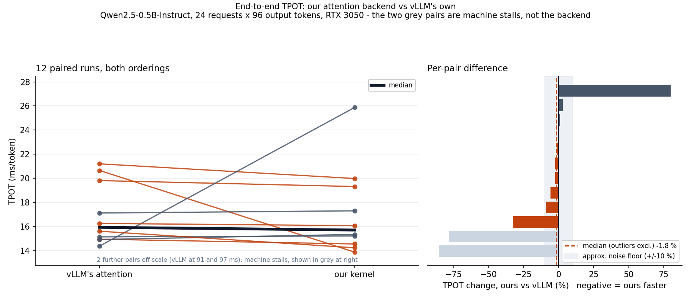
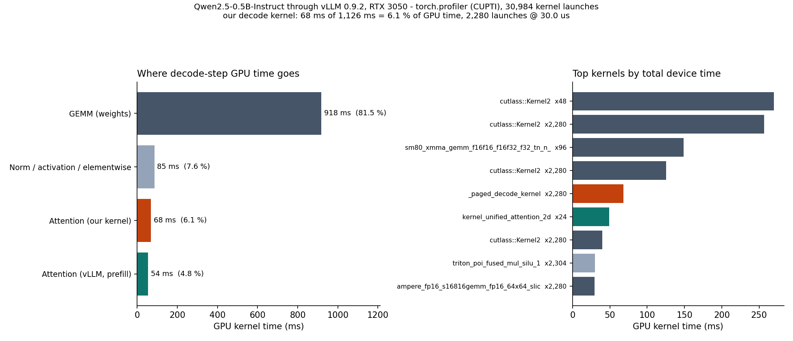

# Paged-KV GQA decode attention - a Triton kernel inside vLLM

A single-token **decode** attention kernel for a paged KV cache with
grouped-query attention, written in Triton and integrated into vLLM as a custom
V1 attention backend, where it serves every decode step of a real model.

> **Scope of this repo: real-model runs only.**
>
> Every number below comes from a real model with real weights -
> Qwen2.5-0.5B-Instruct through a real vLLM engine. Kernel microbenchmarks on a
> synthesized KV cache have been removed, along with the Nsight profiler
> captures, which profiled that same synthetic workload.
>
> **Two results, and they point different ways.**
>
> At the **kernel** level our decode kernel is **1.74x faster** than vLLM's
> FlashAttention decode kernel on the same real workload - 30.0 us against
> 52.0 us, over 2,280 launches each (section 4.2).
>
> At the **end-to-end** level that comes out as **parity**: TPOT is unchanged
> within this machine's noise (section 4). Attention is ~10 % of this model's
> GPU time, and our backend gives back most of the decode win on prefill,
> which it inherits rather than chooses. Section 4.2 decomposes it.

---

## 1. Hardware and software

| | |
|---|---|
| GPU | NVIDIA GeForce RTX 3050 Laptop GPU (GA107, **sm_86**, **16 SMs**, **4.0 GiB**, 128-bit GDDR6) |
| Driver | 561.19 (CUDA 12.6) |
| Host (kernel dev) | Windows 11 Pro 22631, Python 3.13.9, PyTorch 2.12.0+cu126, triton-windows 3.8.0 |
| vLLM host | WSL2 Ubuntu 22.04, **vLLM 0.9.2**, torch 2.7.0+cu126 |
| Model | **Qwen/Qwen2.5-0.5B-Instruct** - 14 q heads / 2 KV heads, head_dim 64, GQA group 7 |

4 GiB is the constraint that shapes this project. vLLM has no Windows build, so
the engine runs under WSL2 on the same GPU (passthrough verified). Qwen2.5-0.5B
is the model used because it is ungated and small enough that a KV pool for 24
concurrent requests still fits alongside the weights at
`--gpu-memory-utilization 0.70`.

---

## 2. The kernel

`pagedattn/triton_decode.py`. One kernel with three `constexpr` switches:

  * `PER_PAGE_BT` - load the block table once per page, not once per token
  * `SPLIT_KV` - partition the KV range across CTAs (FlashDecoding), then reduce
  * `KV_DTYPE` - fp16, fp8_e5m2, or int8 with per-(token, head) scales

One program per `(batch, kv_head[, split])`. All query heads sharing a KV head
run in the same program, so each K/V byte is read from DRAM once and reused
`group` times out of registers - the reason GQA decode is worth a dedicated
kernel at all.

**Layout is vLLM-V1 / FlashInfer NHD** -
`[num_blocks, block_size, num_kv_heads, head_dim]` - chosen so no conversion is
needed anywhere in the integration. `head_dim` varies fastest, so a
`(block, token, head)` row is contiguous and the loads coalesce.

Group and `head_dim` are `constexpr`, so the kernel specializes on demand and
serves any GQA shape without an ahead-of-time instantiation list.

---

## 3. The vLLM backend

`integration/vllm_backend.py` subclasses vLLM's `TritonAttentionBackend` and
overrides **only** `forward`:

```
pure decode  (max_query_len == 1)  ->  our kernel
anything else                      ->  super().forward()
```

Building V1 attention metadata correctly - `query_start_loc`, `slot_mapping`,
block tables, cascade and local-attention variants, CUDA-graph capture paths -
is the version-sensitive part, and inheriting it is both less code and fewer
ways to be wrong.

Because the cache layout already matches, `kv_cache.unbind(0)` yields exactly
the tensors the kernel takes. No conversion, no copy.

`VLLM_ATTENTION_BACKEND` can only name vLLM's built-in `_Backend` enum members,
so an out-of-tree class cannot be selected through it. The real extension point
is one level down: vLLM asks `current_platform.get_attn_backend_cls(...)` for a
qualified name string and imports it with `resolve_obj_by_qualname`. `install()`
patches that one classmethod.

**It verifiably runs** - from [`results/vllm_ab_run.log`](results/vllm_ab_run.log):

```
=== run 1 ours ===
  [backend] our decode kernel ran 2,280 times over 54,720 tokens; 24 calls delegated to vLLM (prefill and non-decode batches)
  [two-point] wall(1 tok)=0.05s  wall(96 tok)=1.88s  -> 19.31 ms/step
```

2,280 = 24 layers × 95 decode steps. The 24 delegated calls are the single
prefill pass, one per layer. `bench_vllm.py` **raises if `decode_calls == 0`** -
a backend that silently falls back would otherwise produce a perfectly plausible
table measuring vLLM's own kernel.

**Deliberate scope limits.** Prefill, mixed prefill+decode batches, fp8 KV
caches, sliding-window and ALiBi layers and soft-capped logits are all delegated
back to vLLM. This is a single-query decode kernel with no causal mask across a
query tile and no positional-bias support; pretending otherwise would produce
wrong numbers rather than an error.

---

## 4. Result: end-to-end TPOT

Qwen2.5-0.5B-Instruct, 24 requests × 96 output tokens, **12 paired runs** - 7
with vLLM's backend first, 5 with ours first, so run-order bias cancels rather
than accumulating.

| | median TPOT | range |
|---|---:|---:|
| vLLM's own attention | 15.93 ms | 14.4 - 21.2 ms |
| ours | 15.70 ms | 13.9 - 25.9 ms |
| **median paired difference** | **−1.8 %** | −33 % to +80 % |

Read the range column before the median one. Two *vLLM-default* runs came in at
**96.6 ms and 91.1 ms** against a 15 ms median - 6× outliers that are the
machine, not the backend (this laptop has sporadic multi-second stalls; the same
effect produced the +80 % pair on our side). Those two are excluded above; with
them the median difference is −2.6 %, the same answer. Either way the spread
swamps the signal: anything under roughly ±10 % is unresolvable here, so the
honest claim is **parity**.

Raw data: [`results/vllm_e2e.json`](results/vllm_e2e.json) (forward order),
[`results/vllm_e2e_rev.json`](results/vllm_e2e_rev.json) (reversed), and the
console log [`results/vllm_ab_run.log`](results/vllm_ab_run.log).
`python bench/analyze_ab.py` reproduces the table from the JSON.



### 4.1 Every run, not just the summary

All 12 pairs. `*` marks the two where the machine stalled; they are kept
in the table rather than quietly dropped.

| # | order | vLLM's attention | our kernel | delta |
|---:|---|---:|---:|---:|
| 1 | vLLM first | 19.81 ms | 19.31 ms | -2.5 % |
| 2 | vLLM first | 21.20 ms | 19.98 ms | -5.8 % |
| 3 | vLLM first | 20.65 ms | 13.87 ms | -32.8 % |
| 4 | vLLM first | 14.94 ms | 14.55 ms | -2.7 % |
| 5 | vLLM first | 15.14 ms | 15.21 ms | +0.5 % |
| 6 | vLLM first | 14.37 ms | 25.88 ms | +80.1 % |
| 7 | vLLM first | 17.12 ms | 17.30 ms | +1.1 % |
| 8 | ours first | 14.92 ms | 15.34 ms | +2.8 % |
| 9 | ours first | 96.62 ms | 13.82 ms | -85.7 % * |
| 10 | ours first | 15.61 ms | 14.23 ms | -8.8 % |
| 11 | ours first | 16.25 ms | 16.07 ms | -1.1 % |
| 12 | ours first | 91.10 ms | 19.48 ms | -78.6 % * |

| | vLLM's attention | our kernel | delta |
|---|---:|---:|---:|
| median, outliers excluded (10 pairs) | 15.93 ms | 15.70 ms | **-1.8 %** |
| median, all 12 pairs | 16.68 ms | 15.70 ms | **-2.6 %** |

Both rows give the same answer, which is the point of showing them together: the
conclusion does not depend on how the outliers are handled.

**Why TPOT and not tokens/sec.** Run 8 is the illustration. Its wall clock was
3.69 s for our backend against 1.46 s for vLLM's, which as raw throughput would
read as a 2.5x loss - but its TPOT was 15.34 ms against 14.92 ms, a 2.8 %
difference. The extra 2.2 s was one-time engine startup, not decode. The
two-point TPOT, `(wall(N) - wall(1)) / (N - 1)`, cancels anything that is not
per-decode-step; dividing tokens by wall clock does not. Throughput numbers are
in the JSON for completeness, but they are contaminated by startup and prefill
and no claim here rests on them.

### 4.2 Kernel-level baseline, same real workload

Both backends profiled with torch.profiler over the identical run
(Qwen2.5-0.5B-Instruct, 24 requests x 96 output tokens). GPU kernel time,
aggregated from the chrome traces:

| | our backend | vLLM's FlashAttention backend | ratio |
|---|---:|---:|---:|
| **Decode attention** | **68.3 ms** (2,280 x 30.0 us) | 118.6 ms (2,280 x 52.0 us) | **1.74x faster** |
| Prefill attention | 49.1 ms (24 x 2,047 us) | 25.7 ms (24 x 1,072 us) | **0.52x - we lose** |
| Attention, total | 117.5 ms | 144.4 ms | 1.23x faster |
| All GPU kernels | 1,126 ms | 1,170 ms | 1.04x faster |
| attention as share of GPU time | 10.4 % | 12.3 % | |

Both backends launch the decode kernel exactly **2,280** times, so this is a
like-for-like per-call comparison: 30.0 us against 52.0 us.

**The decode kernel is 1.74x faster than vLLM's**, on real weights, at this
model's shape. That is the kernel result, and it is the one measurement here
that is well clear of the noise floor, because it is a device-time sum over
2,280 launches rather than a wall-clock difference.

**And we lose prefill by 1.9x**, which is worth more than the win is. Our
backend subclasses vLLM's `TritonAttentionBackend`, so everything we delegate -
including every prefill - goes to vLLM's Triton unified-attention kernel, not to
FlashAttention. The default backend uses FlashAttention for prefill and is
faster at it. We did not choose that tradeoff; we inherited it.

So the ledger for the whole run is: **+50.3 ms saved on decode, -23.4 ms given
back on prefill, +26.9 ms net on attention** - which is 2.3 % of total GPU time,
comfortably inside the +/-10 % wall-clock noise floor. That is the arithmetic
behind section 4's parity result, and it decomposes it into two effects pulling
in opposite directions rather than leaving it as "no difference".

**The obvious next change** is to subclass `FlashAttentionBackend` instead and
delegate prefill there, keeping the decode win and dropping the prefill loss.
That is a change to which base class `PagedAttnTritonImpl` inherits from, not to
the kernel.

Raw artifacts: [`results/profile/decode-ours.txt`](results/profile/decode-ours.txt)
and [`decode-vllm-default.txt`](results/profile/decode-vllm-default.txt), with
the full chrome traces beside them.



### Why parity is the expected result

The profiler in section 4.2 measures it directly: attention is **10.4 %** of
this run's GPU time with our backend, and the whole net attention saving is
**26.9 ms of 1,170 ms, or 2.3 %**. Even making attention *free* would move the
step by ~10 %, barely past this machine's noise floor - and we are not making it
free, we are making one part of it 1.74x faster and another part 1.9x slower.

Attention only dominates a decode step when the KV cache is large relative to
the weights: more KV heads, longer contexts, bigger batches. Qwen2.5-0.5B with
2 KV heads and ~300-token prompts is the far corner from that - it is the model
that *fits in 4 GiB*, not the model where this kernel would matter.

That is the useful finding, and a microbenchmark cannot produce it: a kernel
speedup and a serving speedup are different claims, and the gap between them is
where the prefill regression was hiding. **Choosing where a kernel matters is a
serving decision, not a kernel one.**

### What would move it

A model with more KV heads and longer contexts. Llama-3.2-1B (32/8/64, GQA
group 4) has 4× the KV heads and would make attention a materially larger share
of the decode step; it needs a HuggingFace token, which is the only reason it is
not the model here.

---

## 5. Correctness

`python -m pytest tests -q` → **49 tests**, all passing.

The kernel is checked against a deliberately slow, obvious fp32 reference
(`pagedattn/reference.py`: explicit gather, no fusion) across sequence lengths
chosen to hit awkward cases on purpose - exactly one tile, one token past a
tile, a length that is not a multiple of the page size, an odd length with many
splits - plus ragged batches, group-1 MHA, three KV dtypes, three page sizes,
and fragmented-versus-sequential block tables.

These tests use randomly generated cache contents, because a numerical
correctness check does not depend on the values coming from a real model. They
verify the kernel is right; they make no performance claim.

---

## 6. Reproducing

```bash
pip install -r requirements.txt
python -m pytest tests -q          # 49 correctness tests
```

The end-to-end benchmark, from WSL2 - see
[`integration/README.md`](integration/README.md) for the environment, including
the CUDA-driver trap that produces a vLLM which imports cleanly and cannot run a
single kernel, and how to get Triton compiling without root:

```bash
cd /mnt/e/Projects/inference_benchmark

# 7 pairs with vLLM's backend first, 5 with ours first
bash integration/run_ab.sh 7 5

# pair them up and report the median paired difference
python bench/analyze_ab.py
```

To regenerate the profiler artifacts and the figures:

```bash
# once per backend; --profile writes a table + chrome trace
python integration/bench_vllm.py --backend ours --profile results/profile \
    --model Qwen/Qwen2.5-0.5B-Instruct --requests 24 --output-tokens 96 \
    --max-model-len 1536 --gpu-memory-utilization 0.70
python integration/bench_vllm.py --profile results/profile \
    --model Qwen/Qwen2.5-0.5B-Instruct --requests 24 --output-tokens 96 \
    --max-model-len 1536 --gpu-memory-utilization 0.70

python -m bench.plots --outdir docs
```

TPOT from a profiled run is **not** comparable - CUPTI instrumentation roughly
quadruples it (73.7 ms against 15.7 ms here). Use profiled runs for the kernel
breakdown and unprofiled runs for latency; the repo keeps them separate.

Both orderings matter: the second backend in a pair always sees a warmer GPU, so
running only one direction bakes that bias into the answer. `analyze_ab.py`
reports the result with *and* without the runs this machine's stalls ruined, and
prints both rather than picking the flattering one. A single A-then-B comparison
on this hardware is worth nothing.

### Layout

```
pagedattn/
  config.py          shapes, KV dtypes, VRAM budget
  cache.py           paged cache, block tables, quantization
  reference.py       fp32 reference used by the tests
  triton_decode.py   the Triton kernel (split-KV, per-page BT, 3 KV dtypes)
integration/
  vllm_backend.py    vLLM V1 backend: decode -> our kernel, rest -> vLLM
  bench_vllm.py      a real model through the real engine
  run_ab.sh          the paired A/B both backends are measured with
  README.md          WSL2 environment setup and its traps
bench/
  analyze_ab.py      pairs the A/B runs, reports the paired difference
  plots.py           the two figures, from the real run data
tests/               49 correctness tests vs an fp32 reference
results/             raw A/B run data, console log, profiler output
  profile/           torch.profiler tables + chrome traces, both backends
docs/                figures
```

---

## 7. Status

**Done, measured on a real model:**

- Triton paged-KV GQA decode kernel - split-KV, fp16 / fp8-e5m2 / int8.
- **1.74x faster than vLLM's FlashAttention decode kernel** on the same real
  workload, measured by CUPTI over 2,280 launches each (section 4.2).
- A working vLLM V1 attention backend that **serves every decode step**:
  2,280 decode calls verified by counter, 24 delegated.
- 12 paired end-to-end runs in both orderings, with the outlier handling stated.
- 49 correctness tests against an fp32 reference.

**Honest limits:**

- **End-to-end it is parity, not a win** (section 4). The kernel win is real and
  measured, but attention is ~10 % of this model's GPU time.
- **Our backend is 1.9x slower at prefill** than vLLM's (section 4.2), because it
  subclasses `TritonAttentionBackend` and delegates prefill to vLLM's Triton
  kernel rather than FlashAttention. That is inherited, not chosen, and it eats
  roughly half the decode win. Fixing it is a base-class change.
- **One model only.** Qwen2.5-0.5B-Instruct, chosen because it fits and is
  ungated. It is also close to the worst case for showing a decode-attention
  win.
- **TPOT is a two-point measurement**, `(wall(N) − wall(1)) / (N − 1)`, because
  vLLM's V1 engine does not populate `RequestOutput.metrics`. That yields one
  aggregate number per run, so p90/p99 collapse to p50 and are reported as such
  rather than fabricated from a single sample.
- **This machine is noisy.** Two baseline runs landed at 91 ms and 97 ms against
  a 15 ms median. The noise floor is roughly ±10 %.
- **Decode only.** No prefill, no causal mask across a query tile, no ALiBi or
  soft-capping. Inside vLLM those cases are delegated back, by design.
- **No kernel-level baseline comparison.** Comparisons against FlashAttention-2,
  vLLM's PagedAttention and PyTorch SDPA, the bandwidth sweep, the
  KV-quantization measurements and the Nsight Compute / Systems captures were
  all measured on a synthesized KV cache, and have been removed from this repo
  under its real-models-only scope.
